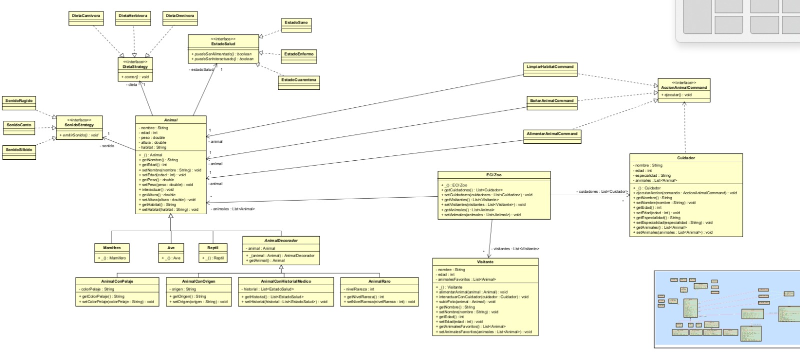

# DOSW-Bootcamp-Laboratorio-02

## Integrantes
-

---

## Reto 8: El Zoológico de los UML

**Evidencia:**

### Aplicación de Principios SOLID
### S – Single Responsibility 

Cada clase del sistema tiene una única responsabilidad bien definida:

Animal: Representa la entidad base de los animales del zoológico.

Mamifero, Ave, Reptil: Especializan el tipo de animal.

SonidoStrategy: Define únicamente el comportamiento de emitir sonido.

DietaStrategy: Define únicamente el comportamiento de alimentación.

EstadoSalud: Gestiona las reglas de interacción según el estado del animal.

AnimalDecorador: Agrega atributos dinámicos sin modificar la clase base.

AccionAnimalCommand: Encapsula acciones ejecutables sobre animales.

Cuidador: Gestiona la ejecución de acciones sobre animales.

Visitante: Representa interacciones básicas con animales y cuidadores.

ECIZoo: Centraliza la gestión de las entidades del sistema.

Cada clase cumple una sola función, evitando responsabilidades múltiples.

### O – Open/Closed 

El sistema está abierto a extensión pero cerrado a modificación.

Se cumple en:

Strategy (Sonido y Dieta): Se pueden agregar nuevos tipos de sonido o dieta sin modificar la clase Animal.

State (Estado de Salud): Se pueden añadir nuevos estados sin modificar la lógica del animal.

Decorator: Se pueden agregar nuevos atributos dinámicos sin modificar la clase base.

Command: Se pueden agregar nuevas acciones para cuidadores sin modificar la clase Cuidador.

### L – Liskov Substitution 

Las clases derivadas pueden sustituir a su clase base sin alterar el comportamiento esperado.Por ejemplo Mamifero, Ave y Reptil pueden utilizarse donde se espere un Animal. O AnimalDecorador también puede utilizarse como Animal.

Todas las implementaciones de SonidoStrategy, DietaStrategy y EstadoSalud pueden sustituir sus respectivas interfaces.

### I – Interface Segregation

Las interfaces están diseñadas de manera específica y no obligan a implementar métodos innecesarios.

SonidoStrategy solo define emitirSonido().

DietaStrategy solo define comer().

EstadoSalud solo define métodos relacionados con permisos de interacción.

AccionAnimalCommand solo define ejecutar().

### D – Dependency Inversion    

Las clases de alto nivel no dependen de implementaciones concretas, sino de abstracciones.

* Animal depende de SonidoStrategy, no de SonidoRugido.

* Animal depende de DietaStrategy, no de DietaCarnivora.

* Animal depende de EstadoSalud, no de EstadoSano.

* Cuidador depende de AccionAnimalCommand, no de comandos específicos.

Reduciendo el acomplamiento y mejora la extensibilidad.

## Patrones de Diseño Utilizados

### Abstract Class y Herencia:

Se utiliza una clase abstracta Animal para definir atributos y comportamientos comunes, permitiendo herencia y polimorfismo mediante Mamifero, Ave y Reptil.

### Strategy:

Aplicado en:

* La interfaz SonidoStrategy

* La interfaz DietaStrategy

Esto permite que el comportamiento de sonido y alimentación cambie en tiempo de ejecución sin modificar la clase Animal y permitiendo mas si es nesesario a futuro

### state:

Aplicado en:

* EstadoSalud

Permite modificar el comportamiento del animal dependiendo de su estado (Sano, Enfermo, Cuarentena) sin utilizar condicionales lo cual acoplaria el codigo y dificultaria su extensibilidad.

### Decorator:

Aplicado en:

* AnimalDecorador

* AnimalConPelaje

* AnimalRaro

* AnimalConHistorialMedico

Permite agregar atributos dinámicos a los animales sin modificar la clase base ni generar múltiples combinaciones de subclases.}

### Command:

Aplicado en:

* AccionAnimalCommand

* AlimentarAnimalCommand

* BañarAnimalCommand

* LimpiarHabitatCommand

Encapsula las acciones realizadas por los cuidadores como objetos independientes, permitiendo extender el sistema sin modificar la clase Cuidador y al Animal a futuras o cambios en las interacciones entre ambos objetos.

---

